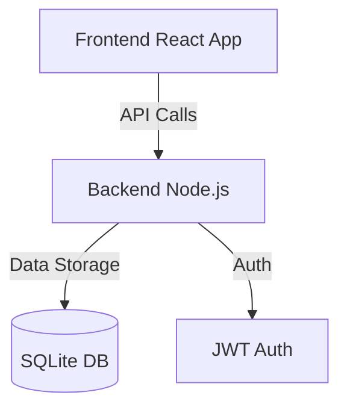
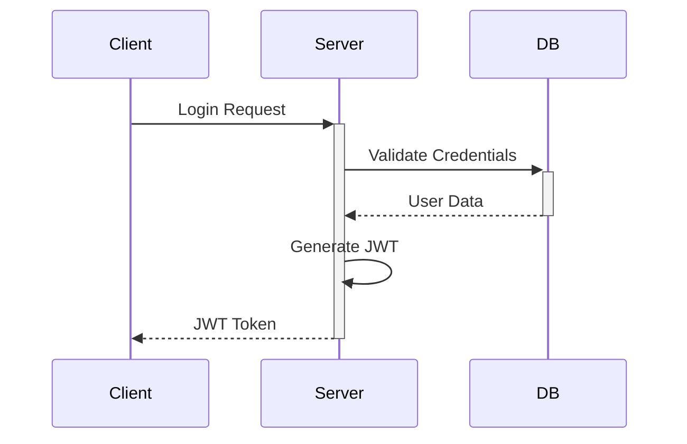

# Project Overview

This document provides an overview of the Sugarcane Machine Management System architecture and development patterns.

## Architecture Overview



## Key Components

### Frontend (sg-fe)
- Single Page Application (SPA)
- Material UI for consistent design
- Protected routes with authentication
- Responsive layout with sidebar navigation

### Backend (sg-be)
- RESTful API endpoints
- JWT-based authentication
- SQLite for data persistence
- Express middleware for request handling

## Development Patterns

### Authentication Flow


### Data Management
- Use CRUD operations for resources
- Implement proper error handling
- Follow RESTful conventions
- Use proper HTTP status codes

### Code Organization
- Follow component-based architecture
- Implement proper separation of concerns
- Use consistent naming conventions
- Maintain clean code practices

## API Endpoints

### Authentication
- POST /api/auth/login
- POST /api/auth/register

### Orders
- GET /api/orders
- POST /api/orders
- PUT /api/orders/:id
- DELETE /api/orders/:id

### Machine Types
- GET /api/machine-types
- POST /api/machine-types
- PUT /api/machine-types/:id
- DELETE /api/machine-types/:id

## Database Schema

### Users
```sql
CREATE TABLE users (
    id INTEGER PRIMARY KEY AUTOINCREMENT,
    username TEXT UNIQUE NOT NULL,
    password TEXT NOT NULL,
    role TEXT NOT NULL DEFAULT 'user',
    created_at DATETIME DEFAULT CURRENT_TIMESTAMP
);
```

### Orders
```sql
CREATE TABLE orders (
    id INTEGER PRIMARY KEY AUTOINCREMENT,
    customer_name TEXT NOT NULL,
    machine_type_id INTEGER NOT NULL,
    quantity INTEGER NOT NULL,
    status TEXT NOT NULL,
    created_at DATETIME DEFAULT CURRENT_TIMESTAMP,
    FOREIGN KEY (machine_type_id) REFERENCES machine_types(id)
);
```

### Machine Types
```sql
CREATE TABLE machine_types (
    id INTEGER PRIMARY KEY AUTOINCREMENT,
    name TEXT NOT NULL,
    description TEXT,
    price DECIMAL(10,2) NOT NULL,
    created_at DATETIME DEFAULT CURRENT_TIMESTAMP
);
``` 